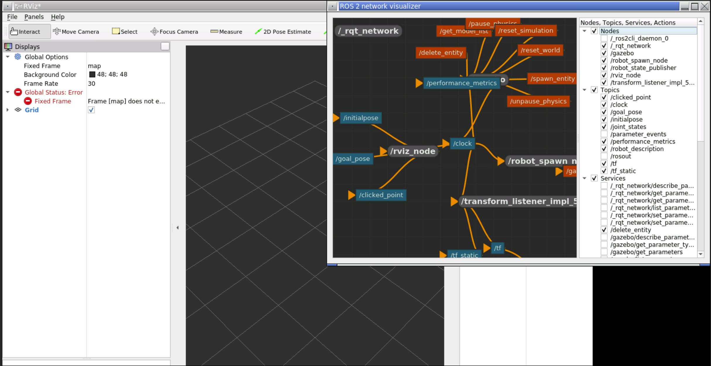

# ROS 2 Workspace with Worked examples in Python
## Course material for [TT102: Introduction to Python for Robotics](https://www.youtube.com/playlist?list=PL1gZJiDypBN4ZYK7Z7EjGrAHSxRekjWwb)
## Instructor: [Dr. Kshitij Tiwari](www.kshitijtiwari.com)


This repository contains a ROS 2 workspace named `example_ws` that runs inside a Docker container. It is configured with `Ubuntu 20.04.6 LTS` and `ROS 2 Foxy`. This workspace includes relevant packages in `Python` that were utilized in the course material by the instructor to allow the learners to replicate the results.

## Prerequisites

Before you start, make sure you have Docker installed on your system.

For this, you can go through the video lecture on [setting up Docker & VS Code](https://youtu.be/YgSkzPHKqhg?si=kYteMMlGn7VWomqJ).

## Getting Started

### Building the Docker Image


```bash
docker build -t example_ws .
```

### Cloning this Git Repository
```
git clone https://github.com/yourusername/example_ws.git
```

### Installing package dependencies
```
./pkg_install.bash
```

### Launching the relevant packages and Sims
```
./launch_gz.bash
```


## ROS 2 Python Packages Included:
This repository comes with the following ROS 2 Python packages included in the `src/` folder.

| Package Name | Node Name | Node Description |
|--------------|-----------|-----------|
| `robot_spawn_pkg` | `spawn_bot.py` | Python ROS2 node to spawn a custom 4 wheeled robot with camera and lidar at a preset initial pose|

## ROS 2 Package Dependencies/Utilities:
In order to test, debug and deploy you may want to additionally install the following ROS2 dependencies/utilities inside your `*_ws/src`

| Package Name | Install Command | Description |
|--------------|-----------|-----------|
| `ros_network_viz` | `git clone https://github.com/ros2/ros_network_viz.git` | ROS2 utility to graphically show all nodes, topics and services and actions|




## Additional resources:
| Resource Name | Description |
|-----------|-----------|
| `basic_bocbot` | A [Github repository](https://github.com/bunchofcoders/basic_bocbot/tree/master) with the office world and robot utilized in this lecture series |
| Introduction to ROS | A [Lecture](https://youtu.be/98AcSbtm2tI?si=CcaCErnL9YAtFSol) introducing ROS and ROS 2 to absolute beginners with intuitive examples|
| RQT Network | A GUI-based ROS2 utility to [visualize](https://github.com/ktiwari9/ros_network_viz) all nodes, topics, services and actions in ROS2|

## License
This project is licensed under the MIT License.

## Contributions
Feel free to contribute to this project by submitting issues or pull requests.
